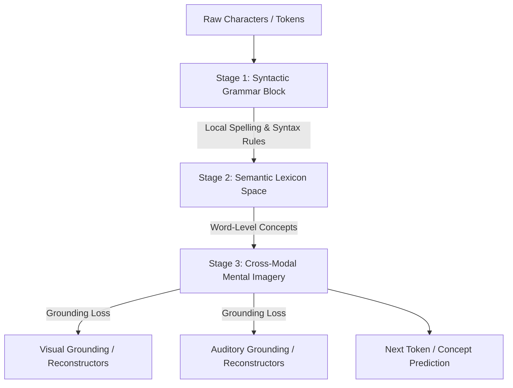

# 🧠 PyAgu: Developmental Neural Intelligence & Mental Imagery Model

> **A custom, biologically inspired neural architecture designed to learn like a human infant—moving from structural syntax to semantic concept-grounding and cross-modal mental imagery.**

---

## 📢 Call to Action: Open-Sourced for Scale
*I designed this custom architecture to challenge the status quo of purely mathematical next-token auto-regression. Because I lack the massive GPU resources required to train a multi-billion parameter model, I am opening this architecture to the community. AI research labs, developers, and curious minds: **Let's scale PyAgu and see how it performs on large-scale datasets!***

---

## 🧬 Architectural Philosophy: The Three Stages of Cognitive Growth

Standard models predict the next word purely using statistical matrix multiplications without any grounding in real-world sensory inputs. **PyAgu is different.** It is structured to learn developmentally:



### 1. Stage 1: Syntactic & Grammar Layer
Instead of converting characters directly to conceptual embeddings, PyAgu uses a local convolutional n-gram block (`GrammarBlock`). This mimics how children first learn spelling, syllable transitions, and local grammatical rules before understanding semantic definitions.

### 2. Stage 2: Semantic Lexicon & Concept Space
Syntactic representations are projected into the `LexiconConceptSpace`. Here, spelling sequences are aggregated into discrete, high-dimensional conceptual embeddings, forming a word-level semantic map.

### 3. Stage 3: Cross-Modal Grounding & Mental Imagery (Understanding)
Understanding is not just matching text; it is the ability to translate text into sensory expectations. PyAgu features a **Mental Imagery bottleneck**:
* **`VisionReconstructor`**: Generates expected visual tokens (`4x128` dimensions) from text representations.
* **`AudioReconstructor`**: Generates expected sound wave features (`2x4` parameters) from text representations.
* **Dual-Objective Loss**: During training, the model is optimized on both next-token cross-entropy and a **Cross-Modal Reconstruction Loss** (forcing the model to correctly "imagine" a red visual frame when it reads the word `"red"`).

---

## 🛠️ Key Modular Components

* **`GrammarBlock`**: Captures multi-scale n-gram patterns using parallel 1D convolutional kernel paths (sizes 3 and 5).
* **`TokenGatedMemory`**: A differentiable working memory controller that sequentially reads from and writes to memory slots using gated erase/add scores (allowing PyAgu to retain active working state dynamically).
* **`HyperPersonaNetwork`**: Generates dynamic scale and shift factors (FiLM modulation) based on active character IDs, routing signals dynamically depending on the selected persona (e.g., Helper, Rebel, Companion, Scholar).

---

## 🚀 Getting Started Locally

PyAgu is optimized to run and train locally on standard laptops (CPU or single GPU).

### Prerequisites
```bash
pip install torch fastapi uvicorn pydantic pillow numpy
```

### 1. Train PyAgu
Train the developmental architecture with dual-objective reconstruction loss:
```bash
python train.py
```

### 2. Run Local Verification
Verify the model's text generation and check its reconstructed vision token outputs:
```bash
python runner.py
```

### 3. Launch the API Server
Start the local FastAPI server to connect the model to the interactive dashboard:
```bash
python server.py
```

---

## 🌐 Research & Scaling Roadmap
To unlock PyAgu's full potential, the architecture should be trained at scale:
* **Pretraining Stage 1**: Train the `GrammarBlock` on massive raw corpora (e.g., Wikipedia, Gutenberg Project) to build advanced spelling and syntactic transition weights.
* **Pretraining Stage 2**: Connect the `VisionReconstructor` and `AudioReconstructor` to massive paired datasets (e.g., image-text, audio-text alignments) to optimize cross-modal grounding.
* **Parameter Scaling**: Expand `d_model` to `4096` and `num_layers` to `32` to build a 7B parameter biological-grade foundation model.

---

*Let's build a model that actually understands what it says. Star this repository and feel free to submit PRs!*
